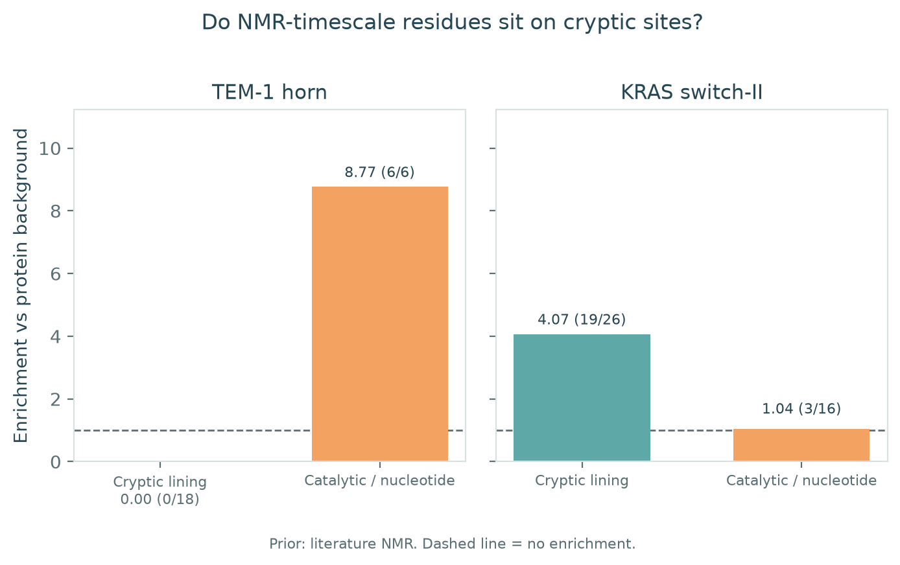
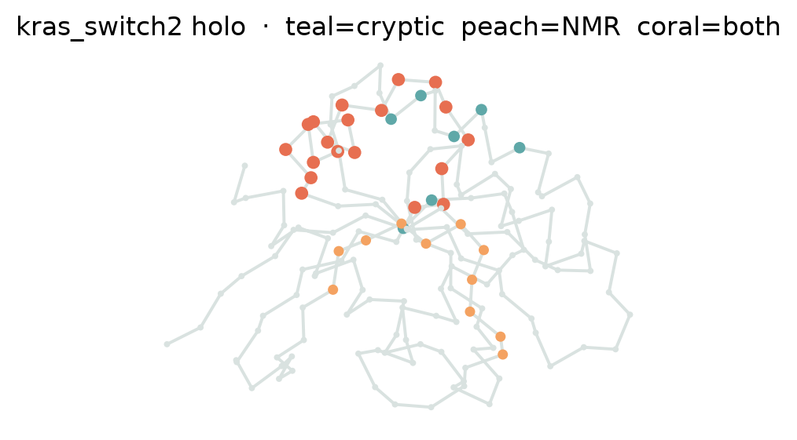
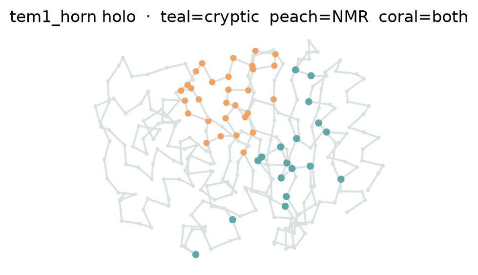
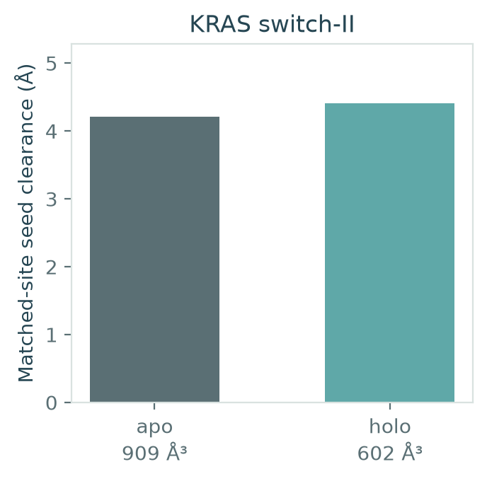
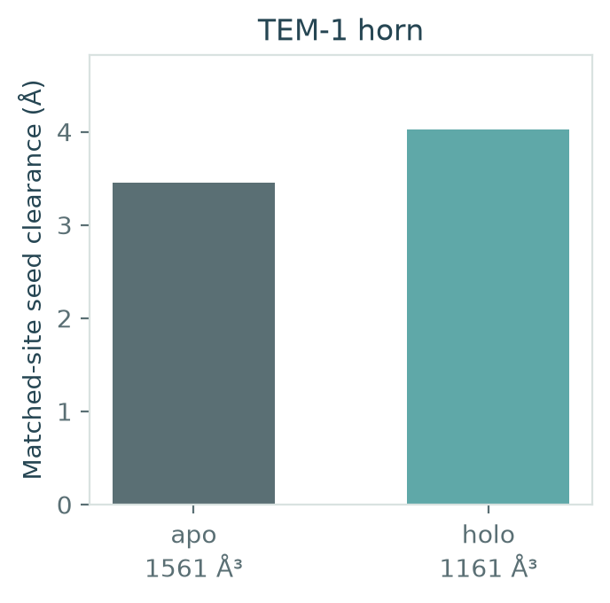

# Pocket Atlas

**Using NMR-timescale dynamics to prioritize cryptic ligandable pockets**

[](https://github.com/snowe36/ai-struct-drugabbility/actions/workflows/ci.yml)
[](LICENSE)

[](demo/)
[](CITATION.cff)

Repo: [github.com/snowe36/ai-struct-drugabbility](https://github.com/snowe36/ai-struct-drugabbility)

<p align="center">
  
</p>

<p align="center"><em>Figure 1. Literature NMR-exchange residues enrich in the KRAS switch-II lining (19/26, 4.07×) and not in the TEM-1 horn (0/18, 0.00×). Dashed line is no enrichment versus protein background.</em></p>

*Dyna-1 says where the protein moves. It does not say the protein opened a pocket.*

---

## What this asks

Cryptic pockets are attractive drug-discovery targets because they can provide ligandable sites outside conserved functional pockets. The challenge is that experimentally observed protein dynamics do not necessarily correspond to pocket opening. Pocket Atlas tests whether NMR-timescale dynamics can be used as a spatial prior for locating such sites.

**Cryptic site:** a ligandable pocket that is poorly accessible or poorly formed in the reference apo structure but becomes accessible or stabilized in an alternative protein conformation.

The detector reports ligand-scale cavities and their residue lining. Overlap then asks whether μs–ms NMR-dynamic residues sit on that lining more than on the catalytic / nucleotide control.

---

## Key result

In KRAS, published μs–ms NMR dynamics substantially overlap the switch-II cryptic pocket, whereas the TEM-1 horn provides a negative case. Dynamics are a prior for pocket localization, not evidence that a pocket opened.

| Case | NMR ∩ cryptic | Cryptic enrichment | NMR ∩ control | Control enrichment |
|------|---------------|--------------------|---------------|--------------------|
| KRAS switch-II | **19/26** | **4.07×** | 3/16 nucleotide | 1.04× |
| TEM-1 horn | **0/18** | **0.00×** | 6/6 catalytic | 8.77× |

`--prior relaxdb` replaces the conservative KRAS YAML subset with the official RelaxDB-CPMG X/Y set (58 residues, including the P-loop): **19/26**, **2.10×** cryptic; 7/16 nucleotide, 1.26×. More labels raise the background, so enrichment falls. TEM-1 stays on literature NMR: RelaxDB-CPMG has no TEM-1 entry (`BLAC_CPMG` is Mtb BlaC, `P9WKD3`, not TEM-1 `P62593`).

TEM-1 horn lining is buried hydrophobic core, not the Ω-loop. Savard & Gagné μs–ms exchange sits at the Ω-loop and active-site vicinity — so zero cryptic overlap is the measurement. KRAS switch-I/II carry both the published exchange and the sotorasib lining.

<p align="center">
  
  
</p>

<p align="center"><em>Figure 2. Cα traces on the holo crystals. Coral = cryptic lining ∩ NMR. KRAS switch-II is a coral cluster; TEM-1 horn (teal) is spatially separate from Ω-loop / active-site exchange (peach).</em></p>

---

## 5-minute demo

```bash
git clone https://github.com/snowe36/ai-struct-drugabbility.git
cd ai-struct-drugabbility
python3.11 -m venv .venv && source .venv/bin/activate
pip install -e ".[dev]"
pocket-demo
# or: bash demo/run_demo.sh
```

Fetches TEM-1 (`1BTL`/`1PZO`) and KRAS (`5V9U`/`6OIM`) from RCSB, detects ligand-scale cavities, and scores literature NMR labels (`--prior literature`) against cryptic lining vs the catalytic / nucleotide control. Official RelaxDB-CPMG labels are `--prior relaxdb` (offline; vendored). Dyna-1 is `--prior dyna1` and needs weights.

Outputs: `out/overlap.md`, `out/figures/`.

Requires **Python 3.11+**. RCSB must be reachable for the first fetch; afterward PDBs live in `data/raw/` (gitignored).

---

## How it works

```text
apo / holo crystals
        ↓
ligand-scale pocket detection
        ↓
NMR / Dyna-1 residue prior
        ↓
cryptic lining vs catalytic / nucleotide control
        ↓
overlap + enrichment
```

| CLI | Role |
|-----|------|
| `pocket-fetch` | Download case PDBs from RCSB |
| `pocket-prepare` / `pocket-detect` | Apo/holo prepare + detect |
| `pocket-overlap --prior {literature,relaxdb,dyna1}` | NMR ∩ cryptic vs control |
| `pocket-dyna` | Optional Dyna-1 (fails closed without weights) |
| `pocket-fetch-md --yes [--extract --analyze]` | VP35 Zenodo (multi-GB; refused without `--yes`) |
| `pocket-md --extract/--analyze` | Stride + CA 225–295 occupancy |
| `pocket-report` / `pocket-figures` | Markdown + matplotlib |
| `pocket-demo` | Five-minute path |

---

## Benchmark cases

| Case | Role | Data |
|------|------|------|
| **TEM-1 horn** | Negative case: cryptic allosteric pocket ~16 Å from Ser70 | Apo `1BTL` vs CBT holo `1PZO` (Horn & Shoichet 2004). NMR: Savard & Gagné 2006 |
| **KRAS switch-II** | Positive case: oral small-molecule cryptic site | G12C·GDP `5V9U` vs sotorasib `6OIM`. NMR: switch-I/II CPMG / RelaxDB KRAS |
| **VP35 IID** | Optional long public MD that opens | Bowman FAST+FAH, CV residues 225–295. `pocket-fetch-md --yes` only |

---

## What the demo actually measures

The detector finds **ligand-scale local maxima of atomic clearance** (empty-sphere clusters in a ~2.6–5 Å band) and reports the residues that line them. YAML `cryptic_site` lists are the published lining of each known cryptic pocket, not whatever cavity scored highest.

Overlap is residue-set geometry:

- **NMR ∩ cryptic** — how many cryptic-lining residues are in the NMR-exchange set
- **Enrichment** — (NMR fraction in the lining) / (NMR fraction in the protein)
- **Control** — the catalytic site (TEM-1) or nucleotide site (KRAS)

Headline apo/holo geometry is **seed clearance**, not matched-site volume. TEM-1 horn clearance rises 3.45 → 4.02 Å (`1BTL` → `1PZO`); KRAS switch-II 4.21 → 4.40 Å (`5V9U` → `6OIM`).

Literature NMR lists (`--prior literature`) are conservative YAML subsets so CI stays offline. Captions must say which prior was used.

<p align="center">
  
  
</p>

<p align="center"><em>Figure 3. Matched-site seed clearance, apo vs holo. ų under each bar is matched-site volume (secondary).</em></p>

---

## Optional Dyna-1

Dyna-1 (Wayment-Steele, Kern *et al.*, *Nature* 2026) predicts per-residue *p*(μs–ms exchange) from missing BMRB assignment-table information. It tracks RelaxDB / CPMG.

Weights: Hugging Face [`gelnesr/Dyna-1`](https://huggingface.co/gelnesr/Dyna-1). Code: [WaymentSteeleLab/Dyna-1](https://github.com/WaymentSteeleLab/Dyna-1).

```bash
pip install -e ".[dyna]"
pocket-dyna --case tem1_horn --pdb data/processed/tem1_horn_apo_1BTL.pdb
```

If weights are missing the command prints why and stops.

---

## Long-timescale MD

Short public MD (~100 ns) is the wrong ensemble for cryptic opening. The long-MD path is public VP35 FAST+FAH (~125 μs, Zenodo [15854842](https://zenodo.org/records/15854842)):

```bash
pip install -e ".[md]"
pocket-fetch-md --yes --extract --analyze
# or, if the tarball is already local:
pocket-md --extract --archive data/raw/vp35/<tarball> --analyze
```

Archives are multi-gigabyte. Extract uses a hard stride; occupancy is the 225–295 CA distance; lining overlap uses Dyna-1 when `data/processed/vp35_iid_dyna1.json` exists. Do not commit trajectories. The five-minute demo does not download this.

---

## Scope

Pocket Atlas is a geometric / NMR-prior analysis framework, not a molecular-docking or free-energy package. It does not attempt to replace MD, docking, FEP, or commercial pocket-detection tools.

---

## Limitations

- `--prior literature` is a curated YAML subset for offline CI
- RelaxDB-CPMG covers KRAS; TEM-1 is absent (`BLAC_CPMG` = Mtb BlaC)
- Dyna-1 is optional; figures must name the prior
- Headline geometry is seed clearance; volume is secondary
- VP35 is download-gated; without the trajectory there is no MD claim

---

## How to reproduce

```bash
git clone https://github.com/snowe36/ai-struct-drugabbility.git
cd ai-struct-drugabbility
python3.11 -m venv .venv && source .venv/bin/activate
pip install -U pip && pip install -e ".[dev]"
bash scripts/reproduce.sh
pytest -q
```

---

## Project layout

```text
src/pocket_atlas/
  cases/          tem1_horn, kras_switch2, vp35_iid YAML
  pockets/        ligand-scale cavity detect
  dynamics/       overlap stats + optional Dyna-1
  prepare/ io/    PDB parse, RCSB fetch, heavy-atom cleanup
  sample/         VP35 Zenodo adapter (opt-in)
  viz/            matplotlib figures, atlas palette
tests/
demo/             five-minute path
out/figures/      README figures
```

---

## Citation

See [`CITATION.cff`](CITATION.cff).

---

## Acknowledgments

Structures from the [RCSB PDB](https://www.rcsb.org/). TEM-1 horn: Horn & Shoichet (2004). TEM-1 NMR: Savard & Gagné (2006). KRAS holo: Canon *et al.* (2019), PDB `6OIM`. Dyna-1 / RelaxDB: Wayment-Steele, El Nesr, Kern *et al.*, *Nature* (2026). VP35 FAST+FAH: Cruz *et al.* (2022); Mallimadugula *et al.* (2025), Zenodo 10.5281/zenodo.15854842.

---

## AI assistance

Cursor was used for code generation, refactoring, documentation, and routine implementation. Scientific design, analysis, validation, and final review were performed by the author.

---

## License

MIT
