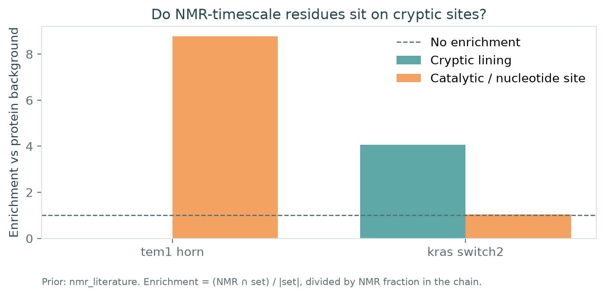
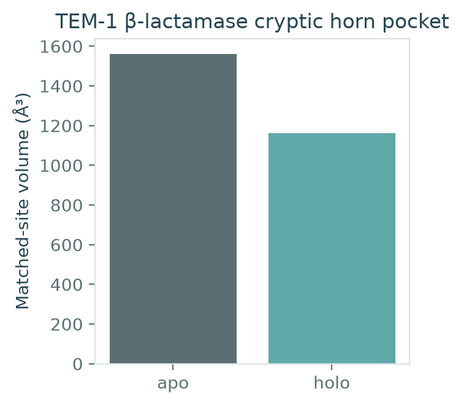
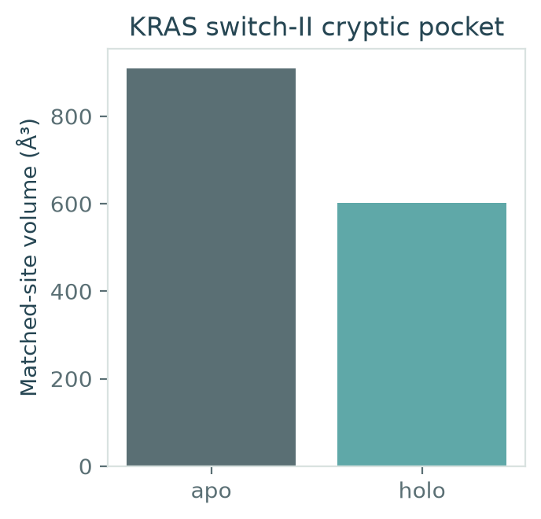

# Pocket Atlas

**NMR-timescale dynamics as a prior for cryptic ligandable sites**

*Dyna-1 says where the protein moves. It does not say the protein opened a pocket.*

> The question is not “run MD until a cavity appears.” It is whether residues that exchange on the μs–ms NMR timescale spatially coincide with cryptic ligandable sites more than with the catalytic / nucleotide site.

Repo: [github.com/snowe36/ai-struct-drugabbility](https://github.com/snowe36/ai-struct-drugabbility)

[](https://github.com/snowe36/ai-struct-drugabbility/actions/workflows/ci.yml)
[](LICENSE)

[](demo/)
[](CITATION.cff)

---

## 5-minute demo

No Dyna-1 weights, no Folding@home, no Zenodo tarball:

```bash
git clone https://github.com/snowe36/ai-struct-drugabbility.git
cd ai-struct-drugabbility
python3.11 -m venv .venv && source .venv/bin/activate
pip install -e ".[dev]"
pocket-demo
# or: bash demo/run_demo.sh
```

Fetches TEM-1 (`1BTL`/`1PZO`) and KRAS (`5V9U`/`6OIM`) from RCSB, detects ligand-scale cavities, and scores literature NMR labels against cryptic lining vs the catalytic / nucleotide control.

Outputs: `out/overlap.md`, `out/figures/`.

---

## The question

**Do NMR-timescale dynamic residues sit on cryptic ligandable sites more than on the obvious functional site?**

Dyna-1 (Wayment-Steele, Kern *et al.*, *Nature* 2026) predicts per-residue *p*(μs–ms exchange) from what is missing in BMRB assignment tables. It tracks RelaxDB / CPMG. It does **not** emit trajectories.

Short public MD (ATLAS / mdCATH, ~100 ns) is the wrong ensemble for cryptic opening. This repo does not use it as evidence. The long-MD arm is public VP35 FAST+FAH (~125 μs, Zenodo [15854842](https://zenodo.org/records/15854842)), opt-in, never downloaded by the demo.

This is not SiteMap, not Desmond, not Glide, not FEP. Geometric pockets here are a documented analogue of a buried-void scan. Prep is heavy-atom cleanup, not Prime.

---

## Three arms

| Arm | Role | Data |
|-----|------|------|
| **TEM-1 horn** | Cryptic allosteric pocket ~16 Å from Ser70 | Apo `1BTL` vs CBT holo `1PZO` (Horn & Shoichet 2004). NMR: Savard & Gagné 2006; RelaxDB-CPMG BLAC |
| **KRAS switch-II** | Oral small-molecule cryptic site | G12C·GDP `5V9U` vs sotorasib `6OIM`. NMR: switch-I/II CPMG / RelaxDB KRAS |
| **VP35 IID** | Long public MD that actually opens | Bowman FAST+FAH, CV residues 225–295. Multi-GB. `pocket-fetch-md --yes` only |

L99A T4 lysozyme is a cavity-creating mutant, not a cryptic site. It is not a campaign arm.

---

## Demo result

Literature NMR labels (not Dyna-1 weights). Pocket volumes are ligand-scale empty-sphere clusters, not the protein interior.

| Case | NMR ∩ cryptic | Cryptic enrichment | NMR ∩ control | Control enrichment |
|------|---------------|--------------------|---------------|--------------------|
| TEM-1 horn | 0/18 | **0.00** | 6/6 catalytic | 8.77 |
| KRAS switch-II | 19/26 | **4.07** | 3/16 nucleotide | 1.04 |

TEM-1: the horn lining is buried hydrophobic core, not the Ω-loop. Savard/Gagné μs–ms exchange is at the Ω-loop and active-site vicinity. Low cryptic enrichment is a result — NMR dynamics are a prior for *motion*, not a pocket oracle.

KRAS: switch-I/II carry the published μs–ms signal **and** line the sotorasib site. Enrichment here is the expected positive control for the same question.

Matched-site volumes (protein conformation only; ligand atoms are not in the distance field): TEM-1 apo `1BTL` 1561 ų / holo `1PZO` 1161 ų; KRAS apo `5V9U` 909 ų / holo `6OIM` 602 ų. Holo is not automatically “more open.” Clearance at the TEM-1 horn seeds does increase (3.45 → 4.02 Å).

<p align="center">
  
</p>

<p align="center"><em>Figure 4. Enrichment of literature NMR-exchange residues in the cryptic lining versus the catalytic (TEM-1) or nucleotide (KRAS) site. Prior = curated labels, not Dyna-1 weights.</em></p>

<p align="center">
  
  
</p>

---

## Workflow

```text
RCSB apo / holo crystals
        │
        ▼
 Prepare (drop waters / unused HET; keep the holo ligand in the PDB)
        │
        ▼
 Ligand-scale pocket detect (local maxima of clearance, 2.6–5 Å)
        │
        ▼
 Match pocket to YAML cryptic lining
        │
        ▼
 NMR / Dyna-1 residue prior
        │
        ▼
 Overlap vs cryptic lining and vs catalytic/nucleotide control
```

| CLI | Role |
|-----|------|
| `pocket-fetch` | Download case PDBs from RCSB |
| `pocket-prepare` / `pocket-detect` | Apo/holo prepare + detect |
| `pocket-overlap` | NMR ∩ cryptic vs control |
| `pocket-dyna` | Optional Dyna-1 (fails closed without weights) |
| `pocket-fetch-md --yes` | VP35 Zenodo (multi-GB; refused without `--yes`) |
| `pocket-report` / `pocket-figures` | Markdown + matplotlib |
| `pocket-demo` | Five-minute path |

---

## Optional Dyna-1

Weights: Hugging Face [`gelnesr/Dyna-1`](https://huggingface.co/gelnesr/Dyna-1). Code: [WaymentSteeleLab/Dyna-1](https://github.com/WaymentSteeleLab/Dyna-1).

```bash
pip install -e ".[dyna]"
pocket-dyna --case tem1_horn --pdb data/processed/tem1_horn_apo_1BTL.pdb
```

If weights are missing the command prints why and stops. The demo never pretends to have run Dyna-1.

---

## VP35 (not in the demo)

```bash
pip install -e ".[md]"
pocket-fetch-md --yes
```

Archives are multi-gigabyte. Occupancy vs the 225–295 CA distance is computed only when `mdtraj` can load frames. CI does not download this.

---

## Schrödinger mapping (v0)

| They have | This repo |
|-----------|-----------|
| Desmond | Not here. Dyna-1 ≠ MD. VP35 FAH is the long-MD analogue |
| SiteMap | Geometric empty-sphere clusters (`pocket_atlas.pockets`) |
| Prime | Heavy-atom prepare, optional OpenMM later |
| Glide / FEP | Out of v0 |

---

## Limitations

- Literature NMR lists are conservative curated subsets, not the full RelaxDB dump
- Dyna-1 is optional; captions must say when the prior is literature labels
- Pocket volumes are a geometric analogue, not SiteMap Dscore
- Detector reports ligand-scale cavities; it is not a licensed SiteMap replacement
- Apo vs holo volume is not a crypticity oracle — TEM-1 holo clearance rises, volume does not
- VP35 is download-gated; without the trajectory there is no MD claim
- No docking, no FEP, no wet-lab activity

---

## How to reproduce

```bash
git clone https://github.com/snowe36/ai-struct-drugabbility.git
cd ai-struct-drugabbility
python3.11 -m venv .venv && source .venv/bin/activate
pip install -U pip && pip install -e ".[dev]"
bash scripts/reproduce.sh
pytest -q
```

Requires **Python 3.11+**. RCSB must be reachable for the first fetch; afterward PDBs live in `data/raw/` (gitignored).

---

## Project layout

```text
src/pocket_atlas/
  cases/          tem1_horn, kras_switch2, vp35_iid YAML
  pockets/        ligand-scale cavity detect
  dynamics/       overlap stats + optional Dyna-1
  prepare/ io/    PDB parse, RCSB fetch, heavy-atom cleanup
  sample/         VP35 Zenodo adapter (opt-in)
  viz/            matplotlib figures, atlas palette
tests/
demo/             five-minute path
out/figures/      README figures
```

---

## Acknowledgments

Structures from the [RCSB PDB](https://www.rcsb.org/). TEM-1 horn: Horn & Shoichet (2004). TEM-1 NMR: Savard & Gagné (2006). KRAS holo: Canon *et al.* (2019), PDB `6OIM`. Dyna-1 / RelaxDB: Wayment-Steele, El Nesr, Kern *et al.*, *Nature* (2026). VP35 FAST+FAH: Cruz *et al.* (2022); Mallimadugula *et al.* (2025), Zenodo 10.5281/zenodo.15854842.

---

## AI Assistance

Development of this repository was assisted by Cursor (AI-powered code editor) for code generation, refactoring, documentation, and routine implementation tasks. All scientific design, algorithmic decisions, validation, testing, and final code review were performed by the author.

---

## License

MIT
