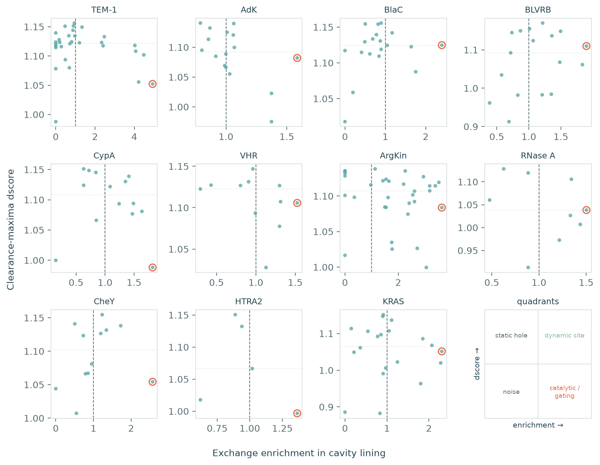
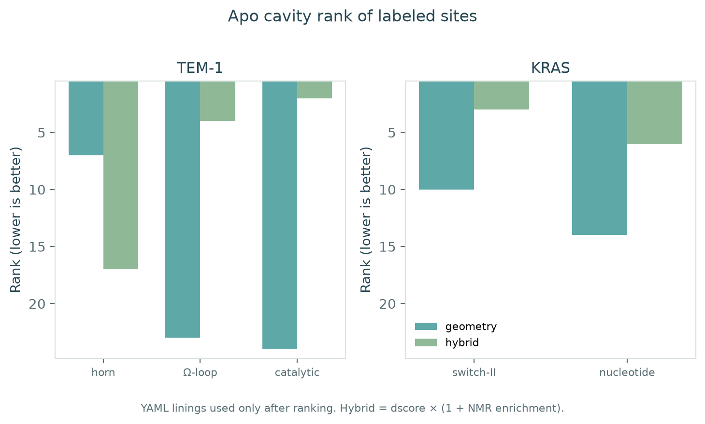
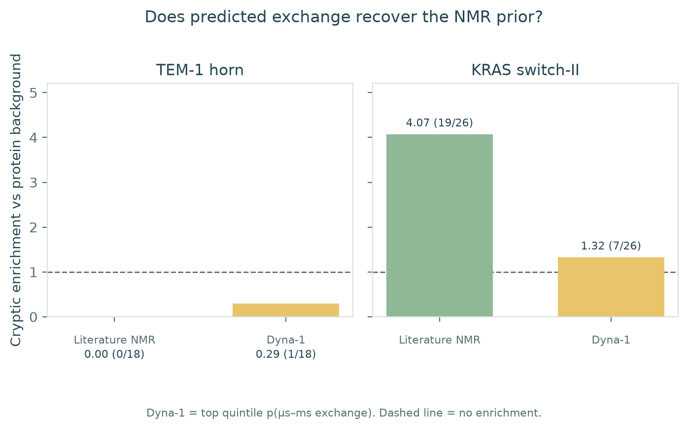
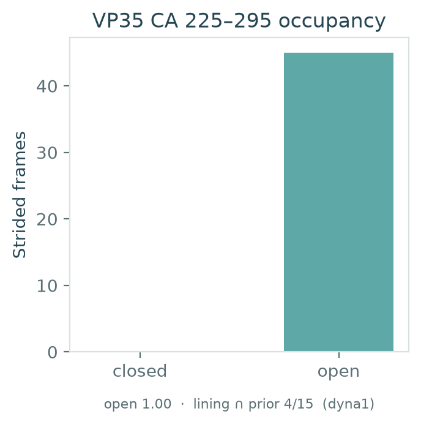
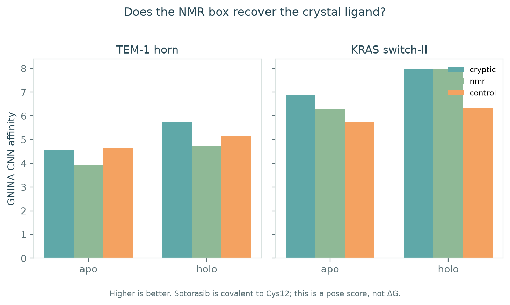

# Pocket Atlas

**Experimental μs–ms NMR exchange, mapped onto every ligand-scale clearance maximum, splits cryptic holes into dynamic sites versus static / ligand-induced ones.**

The detector finds many apo cavities. The interesting object is not a rank list — it is the plane whose *x* is lining exchange enrichment versus the protein background and whose *y* is clearance-maxima `dscore`. Ranking (`dscore × (1 + enrichment)`) is a one-line collapse of that plane. Holo crystals and published linings are read only after scores are frozen.

This is not a PocketMiner retrain. Predicted exchange (Dyna-1) is a weaker spatial prior than published CPMG; the panel below uses experimental labels.

[](https://github.com/snowe36/ai-struct-drugabbility/actions/workflows/ci.yml)
[](LICENSE)

[](demo/)
[](CITATION.cff)

Repo: [github.com/snowe36/ai-struct-drugabbility](https://github.com/snowe36/ai-struct-drugabbility)

---

## The problem

Cryptic pockets are poorly formed in the reference apo structure and become accessible in another conformation. Experimental dynamics do not automatically mean a pocket opened.

**Cryptic site:** a ligandable cavity that is poorly accessible or poorly formed in the apo crystal but becomes accessible or stabilized in an alternative conformation.

A published lining answers *known-site overlap* (do exchange residues sit on that lining?). It does not discover which apo hole is ligandable. Pocket Atlas keeps those tests separate: every cavity is placed on the exchange × clearance plane first; YAML linings are the answer key afterward.

---

## What this repo builds

1. **Detect** ligand-scale local maxima of atomic clearance on apo crystals
2. **Map** official RelaxDB-CPMG exchange (10 proteins) plus TEM-1 literature NMR onto those linings (sequence index → PDB resseq at run time)
3. **Place** every cavity on the exchange-enrichment × `dscore` plane (`pocket-plane`)
4. **Rank** (optional collapse) with leak-free hybrid `dscore × (1 + enrichment)`; YAML only at eval
5. **Optional arms** — Dyna-1 predicted exchange, VP35 FAST+FAH opening, GNINA recovery docking

<p align="center">
  
</p>

<p align="center"><em>Figure 1. Every apo cavity in the RelaxDB-CPMG panel, plus TEM-1 literature NMR. Dashed line: lining exchange matches protein background. Dotted line: per-protein median dscore. Coral rings: highest-enrichment cavity. TEM-1’s exchange maximum is a low-clearance catalytic / Ω-loop hole; KRAS switch-II sits on the high-exchange side of a clearance maximum.</em></p>

---

## Key results

Report: [`out/plane.md`](out/plane.md). Detector 0.2.0, ranker 0.1.0. Sequence mapping for CPMG crystals is **0.908–1.000** (HTRA2 PDZ lowest; RNase A exact). Aquifex AdK uses `2RH5` (`1NKS` is a different AdK sequence).

| Protein | PDB | Prior | Cavities | Max lining enrichment | Enrichment at max `dscore` |
|---------|-----|-------|----------|----------------------|----------------------------|
| TEM-1 | `1BTL` | literature 30 | 30 | **4.93** | **0.95** |
| KRAS | `5V9U` | RelaxDB 58 | 20 | **2.31** | 0.91 |
| ArgKin | `1M15` | RelaxDB 35 | 32 | **3.63** | 1.13 |
| CheY | `3CHY` | RelaxDB 13 | 12 | **2.57** | 1.23 |
| BlaC (Mtb) | `2GDN` | RelaxDB 53 | 19 | **2.40** | 0.90 |
| BLVRB | `1HDO` | RelaxDB 66 | 17 | 1.90 | 1.22 |
| CypA | `2CPL` | RelaxDB 52 | 14 | 1.82 | 0.63 |
| AdK | `2RH5` | RelaxDB 49 | 16 | 1.59 | 0.79 |
| VHR | `1VHR` | RelaxDB 43 | 11 | 1.53 | 0.96 |
| RNase A | `7RSA` | RelaxDB 30 | 9 | 1.50 | 0.63 |
| HTRA2 PDZ | `2PZD` | RelaxDB 32 | 5 | 1.36 | 0.89 |

On **TEM-1**, exchange piles on the catalytic / Ω-loop hole (enrichment **4.49** / **4.07**); the ligandable CBT horn is an enclosed clearance maximum with enrichment **0.66** (hybrid rank **17**). On **KRAS**, the switch-II lining is on the high-exchange side (RelaxDB enrichment **2.07**, hybrid rank **3**; literature subset **2.37**, hybrid **3**). Same prior class, opposite geometry: NMR finds dynamic sites, not every cryptic ligand.

RelaxDB-CPMG has no TEM-1 entry (`BLAC_CPMG` is Mtb BlaC, `P9WKD3`, not TEM-1 `P62593`).

---

## Quick start

```bash
git clone https://github.com/snowe36/ai-struct-drugabbility.git
cd ai-struct-drugabbility
python3.11 -m venv .venv && source .venv/bin/activate
pip install -e ".[dev]"
pocket-plane
```

Fetches the panel crystals from RCSB, detects ligand-scale cavities, maps RelaxDB-CPMG X/Y (and TEM-1 literature NMR) onto each lining, and writes [`data/processed/cpmg_plane.json`](data/processed/cpmg_plane.json), [`out/plane.md`](out/plane.md), and Figure 1.

Five-minute TEM-1 / KRAS overlap walkthrough (no FAH, no PocketMiner):

```bash
pocket-demo
# or: bash demo/run_demo.sh
```

Requires **Python 3.11+**. RCSB must be reachable for the first fetch; afterward PDBs live in `data/raw/` (gitignored).

---

## The exchange × clearance plane

Each point is one apo cavity:

- **x** — (exchange fraction in that lining) / (exchange fraction in the protein). 1 = background
- **y** — ligand-scale clearance-maxima `dscore` (already a hole; the range is tight, ~0.9–1.16)

| Quadrant | Meaning | Here |
|----------|---------|------|
| High exchange, high enclosure | Dynamic ligandable site | KRAS switch-II (hybrid **3**) |
| High exchange, low enclosure | Catalytic / gating loop | TEM-1 Ω-loop + Ser70 (hybrid **4** / **2**) |
| Low exchange, high enclosure | Static or ligand-induced hole | TEM-1 horn (geometry **7**, hybrid **17**) |
| Low exchange, low enclosure | Noise | remaining cavities |

Hybrid ranking is `dscore × (1 + enrichment)`. YAML `cryptic_site` lists never enter `pocket-plane` or `pocket-rank`.

Labeled-site ranks after freeze (literature NMR; [`out/rank.md`](out/rank.md)). RelaxDB-CPMG on KRAS keeps switch-II hybrid **3** and moves nucleotide to **7**.

| Case | Site | Role | Geometry | Hybrid |
|------|------|------|----------|--------|
| TEM-1 | horn | ligandable cryptic (CBT) | 7 | **17** |
| TEM-1 | Ω-loop | Savard/Gagné exchange | 23 | **4** |
| TEM-1 | catalytic | functional pocket | 24 | **2** |
| KRAS | switch-II | ligandable cryptic (sotorasib) | 10 | **3** |
| KRAS | nucleotide | functional pocket | 14 | **6** |

Hybrid top-1 is not the ligandable site in either case. PocketMiner was skipped (no weights/CLI).

<p align="center">
  
</p>

<p align="center"><em>Figure 2. Rank collapse of the same plane (lower is better). TEM-1 NMR promotes the Ω-loop (23 → 4) and demotes the horn (7 → 17). KRAS NMR promotes switch-II (10 → 3).</em></p>

---

## Known-site overlap

A different measurement: NMR ∩ the *published* lining vs a catalytic / nucleotide control. Not the discovery test.

| Case | NMR ∩ cryptic | Cryptic enrichment | NMR ∩ control | Control enrichment |
|------|---------------|--------------------|---------------|--------------------|
| KRAS switch-II | **19/26** | **4.07×** | 3/16 nucleotide | 1.04× |
| TEM-1 horn | **0/18** | **0.00×** | 6/6 catalytic | 8.77× |

<p align="center">
  
</p>

<p align="center"><em>Figure 3. Literature NMR-exchange residues enrich in the KRAS switch-II lining (19/26, 4.07×) and not in the TEM-1 horn (0/18). Dashed line is no enrichment versus protein background.</em></p>

`--prior relaxdb` replaces the conservative KRAS YAML subset with official RelaxDB-CPMG (58 residues, including the P-loop): **19/26**, **2.10×** cryptic; 7/16 nucleotide, 1.26×. More labels raise the background, so enrichment falls.

TEM-1 horn lining is buried hydrophobic core, not the Ω-loop. Savard & Gagné μs–ms exchange sits at the Ω-loop and active-site vicinity — zero cryptic overlap is the measurement. KRAS switch-I/II carry both the published exchange and the sotorasib lining.

<p align="center">
  
  
</p>

<p align="center"><em>Figure 4. Cα traces on the holo crystals. Coral = cryptic lining ∩ NMR. KRAS switch-II is a coral cluster; TEM-1 horn (teal) is spatially separate from Ω-loop / active-site exchange (peach).</em></p>

Headline apo/holo geometry is **seed clearance**, not matched-site volume. TEM-1 horn clearance rises 3.45 → 4.02 Å (`1BTL` → `1PZO`); KRAS switch-II 4.21 → 4.40 Å (`5V9U` → `6OIM`).

<p align="center">
  
  
</p>

<p align="center"><em>Figure 5. Matched-site seed clearance, apo vs holo. ų under each bar is matched-site volume (secondary).</em></p>

---

## Dyna-1 is a weaker prior than published NMR

Dyna-1 (Wayment-Steele, Kern *et al.*, *Nature* 2026) predicts per-residue *p*(μs–ms exchange) from missing BMRB assignment-table information. Overlap uses the top quintile (`--prior dyna1`) on the same cryptic linings.

| Case | Prior | Cryptic | Enrichment | Control |
|------|--------|---------|------------|---------|
| KRAS switch-II | literature NMR | **19/26** | **4.07×** | 3/16, 1.04× |
| KRAS switch-II | Dyna-1 | **7/26** | **1.32×** | 4/16, 1.23× |
| TEM-1 horn | literature NMR | **0/18** | **0.00×** | 6/6, 8.77× |
| TEM-1 horn | Dyna-1 | **1/18** | **0.29×** | 0/6, 0.00× |

<p align="center">
  
</p>

<p align="center"><em>Figure 6. Dyna-1 top-quintile p(exchange) does not recover the KRAS literature enrichment (7/26, 1.32× vs 19/26, 4.07×). TEM-1 horn stays empty (1/18, 0.29×).</em></p>

Scores are cached from apo `1BTL` and `5V9U` (`data/processed/{case}_dyna1.json`). Weights: Hugging Face [`gelnesr/Dyna-1`](https://huggingface.co/gelnesr/Dyna-1). Code: [WaymentSteeleLab/Dyna-1](https://github.com/WaymentSteeleLab/Dyna-1).

```bash
pocket-overlap --prior dyna1
# rescore (needs GPU + weights):
pip install -e ".[dyna]"
pocket-dyna --case tem1_horn --pdb data/processed/tem1_horn_apo_1BTL.pdb
```

If weights are missing, `pocket-dyna` prints why and stops. `--prior dyna1` without a cache falls back to literature NMR.

---

## Opening: VP35 long MD

The only public trajectory in this repo on a cryptic-opening timescale is Bowman FAST+FAH for VP35 IID (Zenodo [15854842](https://zenodo.org/records/15854842)). Strided Zaire FAH (every 50th frame, cap 400; **45 frames** kept) sits entirely on the open side of the published CA 225–295 cutoff (8 Å): mean **19.1 Å** (17.4–21.7). That subset is open-enriched — adaptive sampling of opening, not an equilibrium open fraction.

On closed crystal `3FKE`, detector 0.2.0 already puts a cavity on the YAML lining at geometry rank **1**; Dyna-1 hybrid moves it to **4**. There is no RelaxDB-CPMG for VP35. Dyna-1 on `3FKE` (resseq remapped 218–340) overlaps the YAML lining at **4/15**, **1.31×**.

<p align="center">
  
</p>

<p align="center"><em>Figure 7. Strided Zaire FAH (45 frames): all open vs CA 225–295 = 8 Å. Dyna-1 lining overlap is 4/15 (1.31×).</em></p>

```bash
pip install -e ".[md]"
pocket-fetch-md --yes --extract --analyze
```

Do not commit trajectories. The five-minute demo does not download this.

---

## Occupancy: GNINA recovery docking

If NMR lining is a useful prior, a known cryptic ligand should score in the NMR/cryptic box and not in the catalytic/nucleotide control. Open-source GNINA (Vina search + CNN score), residue-centroid boxes, apo vs holo, ligand-stripped. Sotorasib is covalent to Cys12 — CNN affinity is a pose score, not ΔG.

| Case | Receptor | Cryptic CNN | NMR CNN | Control CNN |
|------|----------|-------------|---------|-------------|
| KRAS switch-II | holo | **7.97** | **7.99** | 6.31 |
| KRAS switch-II | apo | 6.86 | 6.27 | 5.74 |
| TEM-1 horn | holo | **5.75** | 4.75 | 5.14 |
| TEM-1 horn | apo | 4.58 | 3.93 | 4.66 |

KRAS holo: NMR and switch-II boxes recover sotorasib; the nucleotide box does not. TEM-1: the NMR box (Ω-loop / active site) does **not** recover CBT; the horn does, and only once the holo crystal is open. Same mismatch as the plane. Report: [`out/dock.md`](out/dock.md).

<p align="center">
  
</p>

<p align="center"><em>Figure 8. GNINA CNN affinity. KRAS NMR/cryptic boxes recover sotorasib on holo (~8.0 vs nucleotide 6.31). TEM-1 NMR does not recover CBT.</em></p>

```bash
pocket-dock --prior literature   # needs gnina on PATH
pocket-strain                    # ligand GFN2-xTB; needs xtb; fail closed
```

Ligand strain did not finish on this run: the TEM-1 CBT extract pulled 44 atoms (multiple HETATM copies). `pocket-strain` stays fail-closed without `xtb`.

---

## How it works

```text
apo crystal
        ↓
ligand-scale cavity detect
        ↓
map experimental exchange onto each lining
        ↓
exchange × clearance plane
        ↓
optional: hybrid rank collapse (YAML only at eval)
        ↓
optional: known-site overlap · VP35 FAH · GNINA
```

| CLI | Role |
|-----|------|
| `pocket-plane` | RelaxDB-CPMG + TEM-1 plane (Figure 1) |
| `pocket-fetch` | Download case PDBs from RCSB |
| `pocket-prepare` / `pocket-detect` | Apo/holo prepare + detect |
| `pocket-rank --prior {literature,relaxdb,dyna1}` | Apo discovery ranks; YAML only at eval |
| `pocket-overlap --prior {literature,relaxdb,dyna1}` | NMR ∩ cryptic vs control |
| `pocket-dyna` | Optional Dyna-1 (fails closed without weights) |
| `pocket-dock` | GNINA residue-box recovery (fails closed without `gnina`) |
| `pocket-strain` | Ligand-only GFN2-xTB (fails closed without `xtb`) |
| `pocket-fetch-md --yes [--extract --analyze]` | VP35 Zenodo (multi-GB; refused without `--yes`) |
| `pocket-md --extract/--analyze` | Stride + CA 225–295 occupancy |
| `pocket-report` / `pocket-figures` | Markdown + matplotlib |
| `pocket-demo` | Five-minute path (no FAH, no PocketMiner) |

---

## CPMG panel

Official RelaxDB-CPMG dump (X/Y = exchanging). New proteins are a detection panel, not apo/holo `Case` YAMLs.

| id | Protein | UniProt | Crystal |
|----|---------|---------|---------|
| `KRAS_CPMG` | KRAS G12C·GDP | — | `5V9U` |
| `AQADK_CPMG` | Aquifex adenylate kinase | O66490 | `2RH5` |
| `BLAC_CPMG` | *M. tuberculosis* BlaC | P9WKD3 | `2GDN` |
| `BLVRB_CPMG` | Human BLVRB | P30043 | `1HDO` |
| `CYPA_CPMG` | Human cyclophilin A | P62937 | `2CPL` |
| `VHR_CPMG` | Human VHR (DUSP3) | P51452 | `1VHR` |
| `ARGKIN_CPMG` | *Limulus* arginine kinase | P51541 | `1M15` |
| `RNASE_CPMG` | Bovine RNase A | P61824 | `7RSA` |
| `CHEY_CPMG` | *E. coli* CheY | P0AE67 | `3CHY` |
| `HTPDZ_CPMG` | Human HTRA2 PDZ | O43464 | `2PZD` |

TEM-1 (`1BTL`, UniProt P62593) is literature NMR (Savard & Gagné 2006), not RelaxDB-CPMG.

---

## Limitations

- RelaxDB-CPMG is ten deposited proteins; TEM-1 is a literature extra
- `--prior literature` is a curated YAML subset for offline CI
- Captions must name the prior (literature / RelaxDB-CPMG / Dyna-1)
- `dscore` range on already-detected holes is tight (~0.9–1.16); exchange (*x*) is the discriminating axis
- Dyna-1 top-quintile *p*(exchange) is near background on KRAS (7/26, 1.32×) and still misses the TEM-1 horn (1/18, 0.29×)
- Headline geometry is seed clearance; volume is secondary
- VP35 strided FAH (45 frames) is open-enriched (CV 17–22 Å); not an equilibrium open fraction
- VP35 discovery ranking is 3FKE-only here (no local strided xtc)
- PocketMiner lining-mean baseline is optional and fail-closed
- GNINA CNN affinity is a pose score; sotorasib is covalent to Cys12
- Ligand GFN2-xTB strain is optional and fail-closed; this run did not finish (multi-copy CBT HETATM)

---

## Future directions

- More experimental CPMG as RelaxDB grows; hand-curated BMRB lists are a different prior and must be labeled as such
- Open-frame ranking for VP35 when a local strided xtc is present
- Fail-closed PocketMiner lining-mean on the same plane (not a retrain)

---

## How to reproduce

```bash
git clone https://github.com/snowe36/ai-struct-drugabbility.git
cd ai-struct-drugabbility
python3.11 -m venv .venv && source .venv/bin/activate
pip install -U pip && pip install -e ".[dev]"
bash scripts/reproduce.sh
pytest -q
```

`scripts/reproduce.sh` runs `pocket-demo`, `pocket-plane`, and `pocket-rank` on TEM-1 / KRAS.

```bash
pocket-plane
pocket-rank --cases tem1_horn kras_switch2 --prior literature
# optional: VP35 3FKE ranks; open-frame only if the strided xtc exists
# pocket-rank --case vp35_iid --prior dyna1 --open-frame
```

---

## Project layout

```text
src/pocket_atlas/
  cases/          tem1_horn, kras_switch2, vp35_iid YAML
  resources/      RelaxDB-CPMG bundle + crystal panel
  pockets/        ligand-scale cavity detect
  rank/           leak-free apo ranking, plane, post-hoc eval
  dynamics/       overlap stats, sequence map, optional Dyna-1
  prepare/ io/    PDB parse, RCSB fetch, heavy-atom cleanup
  sample/         VP35 Zenodo adapter (opt-in)
  viz/            matplotlib figures, atlas palette
tests/
demo/             five-minute path
out/figures/      README figures
data/processed/cpmg_plane.json
```

---

## Citation

See [`CITATION.cff`](CITATION.cff).

---

## Acknowledgments

Structures from the [RCSB PDB](https://www.rcsb.org/). TEM-1 horn: Horn & Shoichet (2004). TEM-1 NMR: Savard & Gagné (2006). KRAS holo: Canon *et al.* (2019), PDB `6OIM`. Dyna-1 / RelaxDB: Wayment-Steele, El Nesr, Kern *et al.*, *Nature* (2026). VP35 FAST+FAH: Cruz *et al.* (2022); Mallimadugula *et al.* (2025), Zenodo 10.5281/zenodo.15854842.

---

## AI assistance

Cursor was used for code generation, refactoring, documentation, and routine implementation. Scientific design, analysis, validation, and final review were performed by the author.

---

## License

MIT
